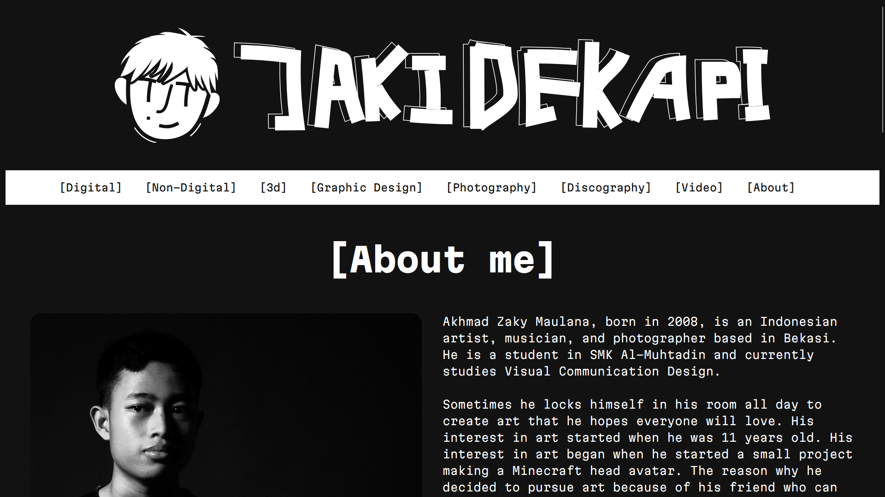

# jakidekapi

My portfolio website. In this website you can look at my artworks.

This website, OF COURSE still needs an improvement because I've programmed it FROM SCRATCH(?) meaning that I DON'T USE ANY FRAMEWORKS AT ALL. It's a pain in the ass. I didn't know it when I was started to plan how the website should look like. Maybe next time I will use frameworks like Bootstrap or similar.

And yeah... That's pretty much it.

Oh, also if you look at my navbar, it doesn't look too "center". It's because I'm unable to center it. I'm sorry.
